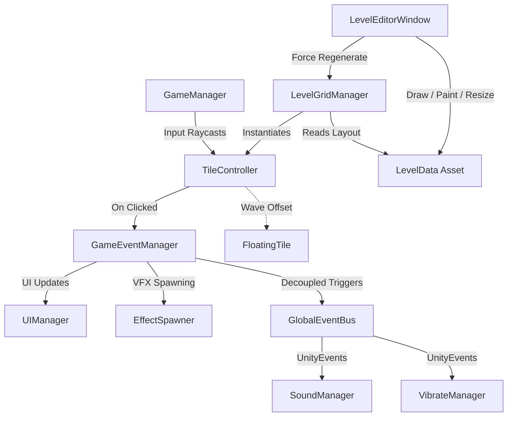

# 🌋 Escape The Lava

A grid-based dynamic action/puzzle game built in Unity 3D where players navigate across moving tiles to collect diamonds while avoiding dangerous rising lava hazards. 

---

## 🛠️ Project Status
> [!NOTE]
> **This project is currently under active development and is not yet complete.** 
> While core gameplay mechanics, level editing, events, sound, and haptics are fully functional, additional levels, polished assets, and advanced UI features are still being integrated.

---

## 🏗️ Architecture & Core Systems

The project utilizes a highly decoupled, event-driven architecture using Unity's ScriptableObjects and a central Event Bus to separate UI, Sound, VFX, and Haptics from core gameplay loop logic.



### Key Components

*   **[`GameManager.cs`](file:///Users/paresh/PROJECT%20WORK/unity/EscapeFromLava/Assets/__Project/Scripts/GameManager.cs)**: Standard Singleton handling the core game states (Ready, Playing, Paused, Won, Lost), player lives, countdown timer, tile selection raycasting, and game rules.
*   **[`LevelData.cs`](file:///Users/paresh/PROJECT%20WORK/unity/EscapeFromLava/Assets/__Project/Scripts/LevelData.cs)**: A `ScriptableObject` containing grid configurations (rows/columns) and tile type layouts. Acts as the data source for levels.
*   **[`LevelGridManager.cs`](file:///Users/paresh/PROJECT%20WORK/unity/EscapeFromLava/Assets/__Project/Scripts/LevelGridManager.cs)**: Reads `LevelData` and handles procedural scene grid layout creation (Orthogonal, Isometric, or Advance Orthographic) on XZ (3D) or XY (2D) planes, applying grid cell spacing and wave animation settings.
*   **[`TileController.cs`](file:///Users/paresh/PROJECT%20WORK/unity/EscapeFromLava/Assets/__Project/Scripts/TileController.cs)**: Component attached to each instantiated tile handling its specific type, grid coordinate coordinates, click triggers, and animation state.
*   **[`FloatingTile.cs`](file:///Users/paresh/PROJECT%20WORK/unity/EscapeFromLava/Assets/__Project/Scripts/FloatingTile.cs)**: Adds an organic wave bobbing effect to grid tiles using a sine wave, synchronized based on spatial offsets.
*   **[`GameEventManager.cs`](file:///Users/paresh/PROJECT%20WORK/unity/EscapeFromLava/Assets/__Project/Scripts/GameEventManager.cs)**: Central C# static event bus notifying subscribers of UI changes, state shifts, and tile clicks.
*   **[`GlobalEventBus.cs`](file:///Users/paresh/PROJECT%20WORK/unity/EscapeFromLava/Assets/__Project/Scripts/GlobalEventBus.cs)**: Subscribes to `GameEventManager` and exposes them as inspector-friendly `UnityEvent` triggers. Used to wire sound and haptic responses without hardcoding.
*   **[`SoundManager.cs`](file:///Users/paresh/PROJECT%20WORK/unity/EscapeFromLava/Assets/__Project/Scripts/SoundManager.cs)**: Manages playing background music (BGM) and triggering random/sequential sound effects (SFX) through AudioMixers.
*   **[`VibrateManager.cs`](file:///Users/paresh/PROJECT%20WORK/unity/EscapeFromLava/Assets/__Project/Scripts/VibrateManager.cs)**: Integrates mobile haptic vibration feedback using the `Solo.MOST_IN_ONE` plugin.

---

## 🎨 Developer Workflows & How-To Guides

### 1. How to Create a New Level

Levels are serialized into asset files using `LevelData` ScriptableObjects. You can create them using the built-in level design editor:

1. Open the Level Editor by going to **`Window -> Escape From Lava -> Level Editor`** in the Unity menu.
2. In the editor window's **Level Data Asset** section, click **Create New**.
3. Choose a name (e.g., `Level2.asset`) and save path inside your project folder (recommended: `Assets/__Project/Pref/Level/`).
4. Under **Grid Dimensions**, set your desired column and row count, then click **Apply Resize**.
5. Select a tile brush from the **Paint Brush Selector**:
    *   **Dark Stone (Default)**: Normal placeholder floor.
    *   **Green Island (Safe)**: Safe ground tiles.
    *   **Red Lava (Danger)**: Lava hazards that take a player life on click.
    *   **Blue Diamond (Diamond)**: Collectible items required to win the level.
6. Paint your level layout by **left-clicking and dragging** over the grid cells. (You can also **right-click** any tile to copy/pick its type).
7. Once finished, click **Save Asset File Changes** at the top.
8. To display the level in the game:
    *   Open `GamePlayScene.unity` from [`Assets/__Project/Scene/`](file:///Users/paresh/PROJECT%20WORK/unity/EscapeFromLava/Assets/__Project/Scene/).
    *   Select the **`LevelGridManager`** GameObject in the hierarchy.
    *   Drag your new `LevelData` asset into the **Active Level** slot.
    *   Adjust layout settings (Isometric/Orthographic, grid plane, padding, wave animation, etc.) and click **Generate Grid in Scene**.

---

### 2. How to Add a New Tile Type

To introduce a new type of tile (e.g., *Yellow Gold* / *Ice Tile* / *Speed Boost*):

1. **Register the Tile**: Open [`TileType.cs`](file:///Users/paresh/PROJECT%20WORK/unity/EscapeFromLava/Assets/__Project/Scripts/TileType.cs) and add your type to the enum list:
    ```csharp
    public enum TileType
    {
        DarkStone = 0,
        GreenIsland = 1,
        RedLava = 2,
        BlueDiamond = 3,
        YellowGold = 4 // <-- Added new tile
    }
    ```
2. **Add a Prefab Reference**: Open [`LevelGridManager.cs`](file:///Users/paresh/PROJECT%20WORK/unity/EscapeFromLava/Assets/__Project/Scripts/LevelGridManager.cs) and add a serialized prefab field:
    ```csharp
    [SerializeField] private GameObject yellowGoldPrefab;
    ```
    Then, update `GetPrefabForType(TileType type)` inside `LevelGridManager.cs`:
    ```csharp
    public GameObject GetPrefabForType(TileType type)
    {
        return type switch
        {
            TileType.DarkStone => darkStonePrefab,
            TileType.GreenIsland => greenIslandPrefab,
            TileType.RedLava => redLavaPrefab,
            TileType.BlueDiamond => blueDiamondPrefab,
            TileType.YellowGold => yellowGoldPrefab, // <-- Added case
            _ => null
        };
    }
    ```
3. **Configure Editor Painting**: Open [`LevelEditorWindow.cs`](file:///Users/paresh/PROJECT%20WORK/unity/EscapeFromLava/Assets/__Project/Scripts/Editor/LevelEditorWindow.cs):
    *   In `DrawBrushSelector()`, add a brush button for your new tile:
        ```csharp
        DrawBrushButton(TileType.YellowGold, "Yellow Gold (Bonus)", new Color(0.9f, 0.8f, 0.1f));
        ```
    *   Configure how it appears inside the visual editor grid by updating `GetColorForTileType(TileType type)` and `GetAbbreviationForTileType(TileType type)`:
        ```csharp
        TileType.YellowGold => new Color(0.9f, 0.8f, 0.1f), // Color
        TileType.YellowGold => "YG",                         // Label
        ```
4. **Implement Gameplay Interactions**: Open [`GameManager.cs`](file:///Users/paresh/PROJECT%20WORK/unity/EscapeFromLava/Assets/__Project/Scripts/GameManager.cs) and add interaction behavior inside `ProcessTileInteraction(TileController tile)`:
    ```csharp
    case TileType.YellowGold:
        if (tile.IsCollected) break;
        tile.IsCollected = true;
        // Do custom bonus points, speed up timer, etc.
        break;
    ```
5. **Assign the Prefab in Inspector**: Select the **`LevelGridManager`** GameObject in Unity, and drag your new tile prefab into the exposed slot.

---

### 3. How to Add Particles and Visual Effects on Tile Tap

Particles are handled dynamically by [`EffectSpawner.cs`](file:///Users/paresh/PROJECT%20WORK/unity/EscapeFromLava/Assets/__Project/Scripts/EffectSpawner.cs) subscribing to click events.

1. Open [`EffectSpawner.cs`](file:///Users/paresh/PROJECT%20WORK/unity/EscapeFromLava/Assets/__Project/Scripts/EffectSpawner.cs).
2. Add fields for your custom particle prefabs, lifetime, and offsets:
    ```csharp
    [Header("Gold Tile FX Settings")]
    [SerializeField] private GameObject goldSparklePrefab;
    [SerializeField] private float goldSparkleLifetime = 1.2f;
    [SerializeField] private Vector3 goldSparkleOffset = new Vector3(0f, 0.5f, 0f);
    ```
3. Update `SpawnTileEffect(TileController tile, Vector3 worldPosition)` to listen to clicks on your specific tile type:
    ```csharp
    private void SpawnTileEffect(TileController tile, Vector3 worldPosition)
    {
        if (tile == null) return;
        
        switch (tile.Type)
        {
            // Existing tile types...
            
            case TileType.YellowGold:
                if (goldSparklePrefab != null)
                {
                    GameObject fx = Instantiate(goldSparklePrefab, worldPosition + goldSparkleOffset, Quaternion.identity);
                    Destroy(fx, goldSparkleLifetime);
                }
                break;
        }
    }
    ```
4. Assign your particle effect prefab (e.g. from `Assets/__Project/Pref/Sfx/`) to the script component in the Unity Inspector.

---

### 4. How to Set or Change Sounds

Sounds are configured in the `SoundManager` and decoupled via UnityEvents.

#### Replacing Existing Sounds:
1. Select the **`SoundManager`** GameObject in the Unity scene.
2. In the inspector, locate the target audio clip field:
    *   `Background Music Clip` (for looping music on start).
    *   `Grass Click Clips` / `Lava Click Clips` / `Diamond Click Clips` (supports arrays for randomized clicks).
    *   `Win Clip` / `Lose Clip`.
3. Drag and drop new `AudioClip` assets into these slots.

#### Triggering New Sound Behaviors:
If you want to play a sound for a new event (e.g., clicking on a Yellow Gold tile):
1. Open [`SoundManager.cs`](file:///Users/paresh/PROJECT%20WORK/unity/EscapeFromLava/Assets/__Project/Scripts/SoundManager.cs) and add the clip field and helper function:
    ```csharp
    [SerializeField] private AudioClip[] goldClickClips;

    public void PlayGoldClick()
    {
        PlayRandomSFX(goldClickClips);
    }
    ```
2. Open [`GlobalEventBus.cs`](file:///Users/paresh/PROJECT%20WORK/unity/EscapeFromLava/Assets/__Project/Scripts/GlobalEventBus.cs) and expose a new `UnityEvent`:
    ```csharp
    [SerializeField] private UnityEvent onGoldClicked;
    public UnityEvent OnGoldClicked => onGoldClicked;
    ```
    Invoke it inside `HandleTileClicked`:
    ```csharp
    case TileType.YellowGold:
        onGoldClicked?.Invoke();
        break;
    ```
3. In the Unity Inspector of your **`GlobalEventBus`** GameObject:
    *   Find the **On Gold Clicked** UnityEvent.
    *   Click **`+`**, drag the **`SoundManager`** GameObject into the target slot, and select the function `SoundManager.PlayGoldClick`.

---

### 5. How to Set/Change Vibration Intensity

Haptics are managed through [`VibrateManager.cs`](file:///Users/paresh/PROJECT%20WORK/unity/EscapeFromLava/Assets/__Project/Scripts/VibrateManager.cs) which uses the **Solo MOST_IN_ONE** plugin.

1. Select the **`VibrateManager`** GameObject in your Unity hierarchy.
2. The script exposes vibration configuration dropdowns using the `MOST_HapticFeedback.HapticTypes` enum:
    *   `Grass Click Haptic`
    *   `Lava Click Haptic`
    *   `Diamond Click Haptic`
    *   `Win Haptic`
    *   `Lose Haptic`
3. Click the dropdown next to any of these settings to adjust vibration intensity:
    *   **Light Impact / Soft Impact**: Perfect for grass/safe tile taps.
    *   **Medium Impact**: Perfect for diamond collectibles.
    *   **Heavy Impact / Rigid Impact**: Perfect for damage/lava taps.
    *   **Success / Failure**: Rhythmic patterns for winning or losing levels.
4. *Fallback Logic*: If haptic feedback is disabled in the settings or unsupported on the device (e.g. standard desktop), it will execute a default vibration call using:
    ```csharp
    Handheld.Vibrate();
    ```

---

## 🧑‍💻 Code Guidelines

When contributing to this codebase, make sure to strictly follow the rules in [`.agents/AGENTS.md`](file:///Users/paresh/PROJECT%20WORK/unity/EscapeFromLava/Assets/__Project/.agents/AGENTS.md):
*   **SOLID & KISS Principles**: Keep scripts specialized and single-purpose.
*   **Caching Component References**: Never run search operations like `GetComponent`, `GameObject.Find`, or `FindObjectOfType` inside `Update()`, `LateUpdate()`, or `FixedUpdate()`. Cache references during `Awake()` or `Start()`.
*   **Physics Code**: All physics/rigidbodies adjustments must happen inside `FixedUpdate()`.
*   **Optimization**: Avoid garbage collection spikes from continuous string concatenation or frequent `Instantiate()` / `Destroy()` loops on high-frequency components. Use object pooling when necessary.
